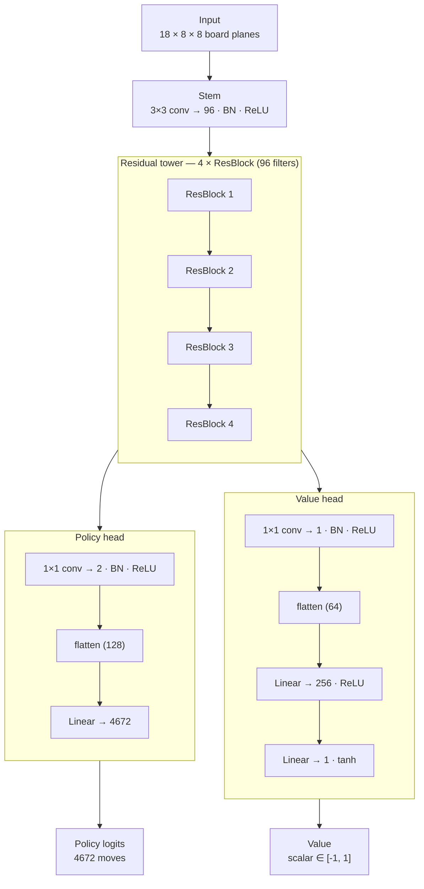

# Chess AI Engine

A chess web app (React + Vite) where you play White against an AlphaZero-style
bot. The bot is a small ResNet with policy-and-value heads, trained from random
init by self-play and run in the browser via `onnxruntime-web` (WebGPU when
available, WASM fallback) with PUCT MCTS at inference time.

## Neural network

A single `ResBlock` is two 3×3 convolutions (96 filters, BN, ReLU) with a skip
connection: `ReLU(BN(conv2(ReLU(BN(conv1(x))))) + x)`. The whole net is
~1.3 M parameters. The policy head emits 4672 move logits; the value head emits
a scalar in `[-1, 1]` from the side-to-move's point of view.
