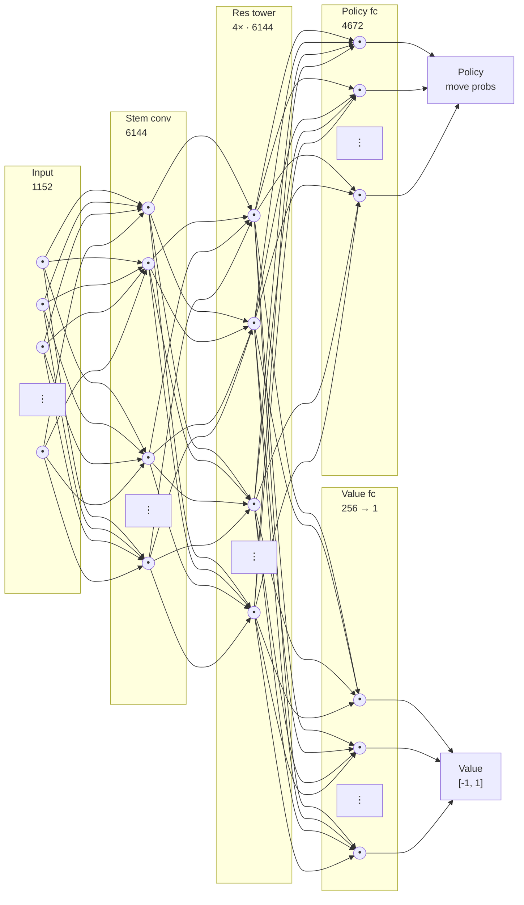

# Chess AI Engine

A chess web app (React + Vite) where you play White against an AlphaZero-style
bot. The bot is a small ResNet with policy-and-value heads, trained from random
init by self-play and run in the browser via `onnxruntime-web` (WebGPU when
available, WASM fallback) with PUCT MCTS at inference time.

## Neural network

Input is on the far left, output on the far right. Each layer is drawn as a
column of neurons; a `⋮` and the count stand in for the thousands not shown
(the real layers are far too wide to draw every node).

Layer widths: input `18 × 8 × 8 = 1152`, stem and each of the 4 ResBlocks
`96 × 8 × 8 = 6144`, policy head `4672` move logits, value head `64 → 256 → 1`
(a scalar in `[-1, 1]` from the side-to-move's point of view). A single
`ResBlock` is two 3×3 convolutions (96 filters, BN, ReLU) with a skip
connection: `ReLU(BN(conv2(ReLU(BN(conv1(x))))) + x)`. The whole net is
~1.3 M parameters. Note the conv layers are only *locally* connected (each
neuron sees a 3×3 patch), not fully connected as the edges above suggest.
