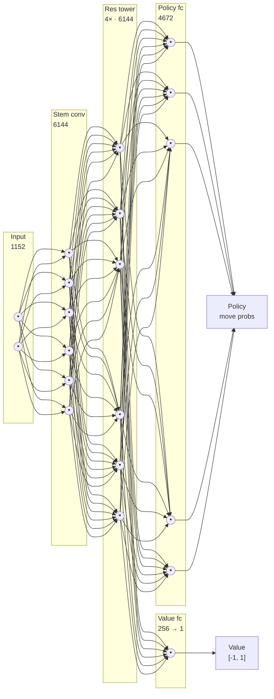

# Chess AI Engine

A chess web app (React + Vite) where you play White against an AlphaZero-style
bot. The bot is a small ResNet with policy-and-value heads, trained from random
init by self-play and run in the browser via `onnxruntime-web` (WebGPU when
available, WASM fallback) with PUCT MCTS at inference time.

## Neural network

Layer widths: input `18 × 8 × 8 = 1152`, stem and each of the 4 ResBlocks
`96 × 8 × 8 = 6144`, policy head `4672` move logits, value head `64 → 256 → 1`
(a scalar in `[-1, 1]` from the side-to-move's point of view). A single
`ResBlock` is two 3×3 convolutions (96 filters, BN, ReLU) with a skip
connection: `ReLU(BN(conv2(ReLU(BN(conv1(x))))) + x)`. The whole net is
~1.3 M parameters. Note the conv layers are only *locally* connected (each
neuron sees a 3×3 patch), not fully connected as the edges above suggest.

## Strength

The same network plays far better with search than without it. "With MCTS"
runs 400-simulation PUCT search at inference; "without MCTS" plays the raw
policy head (argmax over legal-move logits, no search).

Head to head over 100 games (alternating colors, 2-ply random openings):

| Matchup | Record (W/D/L) | Score |
| --- | --- | --- |
| With MCTS vs without MCTS | 77 / 23 / 0 | 0.885 |

Both configurations were also anchored against Stockfish 17.1
(`UCI_LimitStrength`, 0.1 s/move) over 100 games each to estimate an absolute
Elo:

| Configuration | Stockfish anchor | Score (W/D/L) | Elo (95% CI) |
| --- | --- | --- | --- |
| With MCTS (400 sims) | 2300 | 0.465 (32 / 29 / 39) | **~2276** (2205–2344) |
| Without MCTS (raw policy) | 1500 | 0.500 (40 / 20 / 40) | **~1500** (1431–1569) |

So search is worth roughly **+780 Elo** on top of the network's raw instinct.
The evaluation harness lives in `eval_stockfish/` (`match.py` for the Stockfish
anchor, `match_mcts_vs_raw.py` for the head-to-head).

## Training method: AlphaZero (MCTS) vs vanilla REINFORCE

The repo has two independent trainers for the *same* network: the AlphaZero-style
trainer in `training/` (MCTS-guided self-play, with policy/value targets distilled
from the search tree) and a vanilla **REINFORCE** policy-gradient trainer in
`training-reinforce/` (no search — moves are sampled from the raw policy and pushed
toward the game outcome). To measure what the MCTS-in-the-loop training actually
buys, we played their snapshots head to head.

The matchup: `snap_h00073` from the REINFORCE run (≈73 h self-play) vs
`snap_h00052` from the AlphaZero run (≈52 h self-play) — note the REINFORCE net had
*more* self-play time. 200 games per condition, alternating colors,
temperature-sampled openings, draw-adjudicated at 200 plies.

| Condition | REINFORCE record (W/D/L) | REINFORCE score | Elo gap (AlphaZero − REINFORCE) |
| --- | --- | --- | --- |
| Raw policy, no MCTS | 6 / 35 / 159 | 0.118 | **+350** |
| With MCTS (400 sims, both sides) | 0 / 35 / 165 | 0.088 | **+407** |

The MCTS-trained network wins ~88–91% either way. Adding 400-sim search at play
time *widens* the gap rather than closing it: search amplifies the AlphaZero net
(which was trained to be searched) but does little for the REINFORCE net — a pure
policy that never learned to exploit a tree — which actually scored slightly worse
with MCTS than without.

Anchored against Stockfish 17.1, the REINFORCE net (raw policy) is only
**≈850 Elo** (95% CI ~560–1000, a lopsided single-anchor estimate): it loses ~90%
even to the weakest reachable Stockfish (Skill 0, 1-node search), i.e. it sits
*below* Stockfish's entire calibrated range. For reference the AlphaZero net with
MCTS measures **≈2300 Elo** on the same harness.

**Takeaway:** training the same network with MCTS-guided self-play instead of
vanilla REINFORCE is worth on the order of **+350–400 Elo head-to-head** — and far
more on an absolute scale — despite the REINFORCE model logging *more* self-play
hours. Search in the training loop, not just at inference, is what carries the
network from beginner-level instinct to a strong engine.
